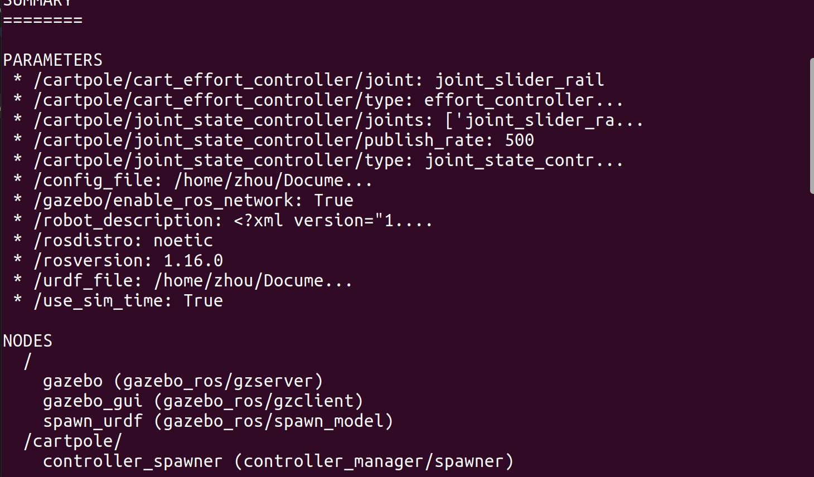
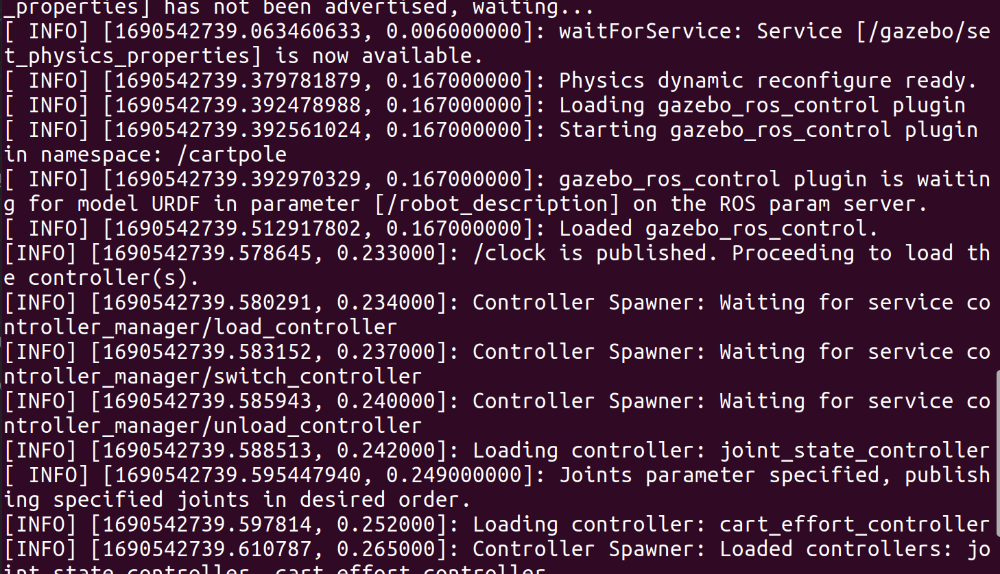
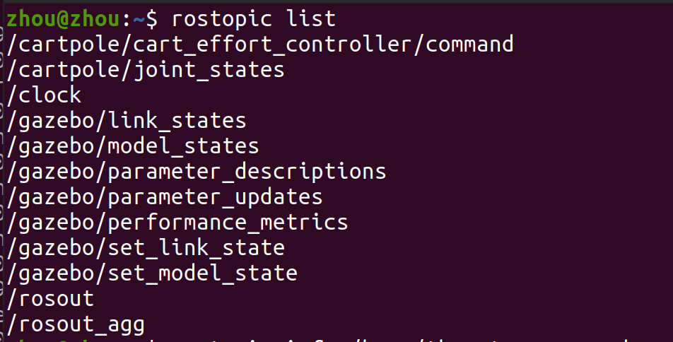
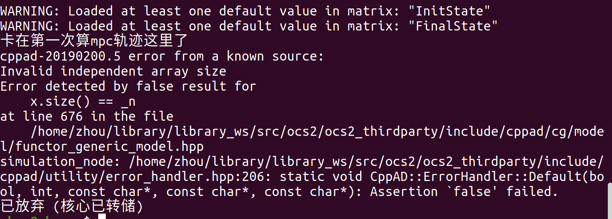

# 问题描述

首先是 gazebo 环境开启正常无报错,控制器启动正常





rostopic 中能正常找到对应的/cartpole/joint_states 话题



运行程序后,报错



这个报错信息我首先想到的是 vector 的维度没对应上,但状态变量为 8 个,输入变量为 1 个没什么问题,Q 矩阵 8 \* 8 且 R 矩阵 1 \* 1 也没什么问题,那会不会是因为/cartpole/joint_states 话题并没有返回 8 个变量,故我将以下内容注释了,以保证数组不越界,但还是有问题:

```cpp
        // observation.state << msg->position[0],
        //     msg->position[1],
        //     msg->position[2],
        //     msg->position[3],
        //     msg->velocity[0],
        //     msg->velocity[1],
        //     msg->velocity[2],
        //     msg->velocity[3];
```

还有不确定的地方在于加载参数这里,不太清楚这里加载的参数是什么,如果配置文件里没有也不报错,具体还应该到官网文档看看

```cpp
    loadData::loadCppDataType(configFile, "MaxForceConstraintPenalty.scale", scale);
    loadData::loadCppDataType(configFile, "MaxForceConstraintPenalty.stepSize", stepSize);
    auto rolloutSettings = rollout::loadSettings(configFile, "rollout");
    TimeTriggeredRollout rollout(*ocp.dynamicsPtr, rolloutSettings);
    auto ddpSettings = ddp::loadSettings(configFile, "ddp");
    auto mpcSettings = mpc::loadSettings(configFile, "mpc");
```
